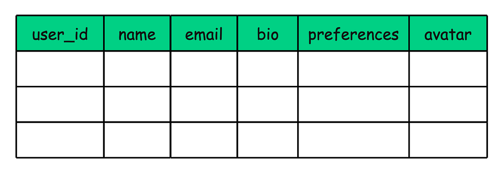
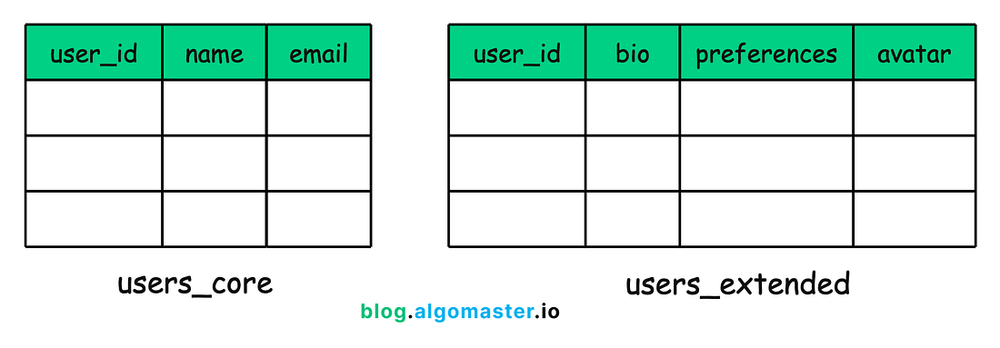
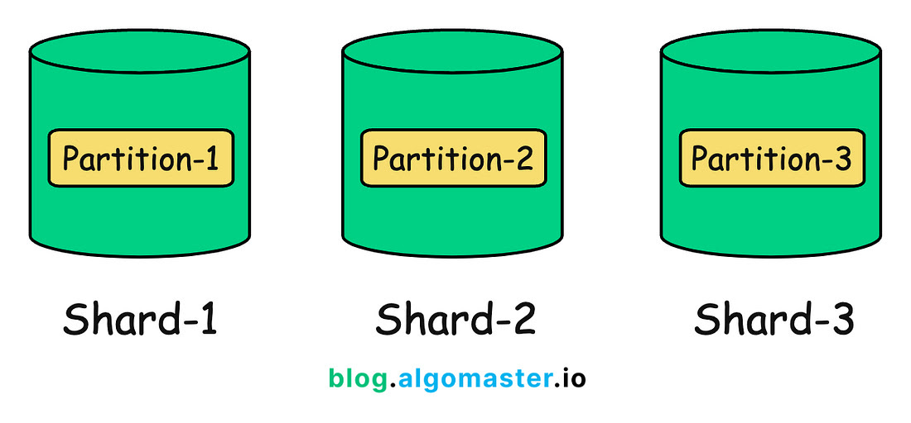
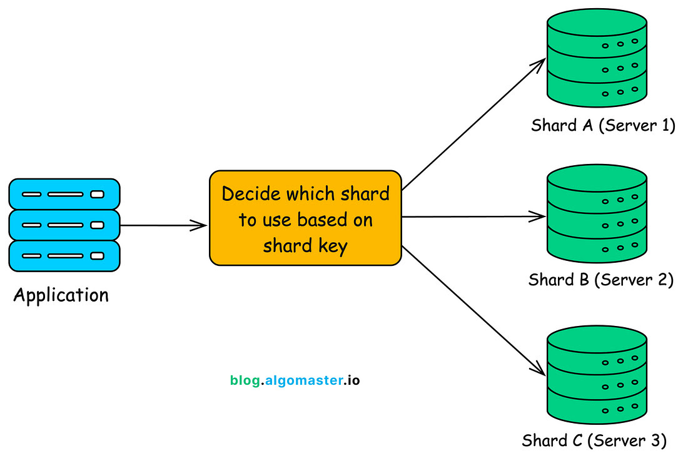
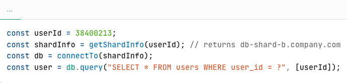

# Sharding vs. Partitioning

Sharding and partitioning are two of the most commonly confused concepts in system design.
At first glance, they may seem similar, and people often use them interchangeably. But they are not.
Both are techniques to **divide and scale large databases**; however, they differ in how the data is divided.


Simply put, partitioning typically means breaking down database tables within a single server while sharding is about distributing data across multiple servers.

In this article, we’ll clear up the confusion between the two. You’ll learn:


### What each term really means


### How they work under the hood

Real-world examples with SQL and code


## 1. What is Partitioning?

Partitioning is the process of splitting a large database table (or index) into smaller, more manageable chunks called partitions, all within the same database instance.


Each partition holds a subset of the data. This means the database can skip scanning the entire table and instead operate only on the relevant partition, which significantly improves performance for queries that filter on the partition key.

Partitioning is also great for simplifying maintenance. Instead of working on a huge monolithic table, you can operate on individual partitions when:


### Archiving or deleting old records


### Reorganizing storage


### Reindexing subsets of data

Even though these partitions look and behave like separate sub-tables under the hood, your application still sees and interacts with them as one unified table.

When you partition a table, each partition might be stored in a different physical file or disk location, but they almost always remain on the same server, managed by a single database engine.

The database keeps an internal mapping of which partition holds which data, based on the partition key and the rule you define.

Example: Partitioning a logs Table by Month

Imagine you have a table called logs that stores application logs with millions of rows. Each row has a timestamp column.

Instead of keeping all log entries in a single massive table, you can partition it by month using the timestamp column as the partition key.

So internally, the database will create partitions like:

logs_2024_01 for January 2024

logs_2024_02 for February 2024

logs_2024_03 for March 2024...and so on.


### Query to Create PARTITION

```

CREATE TABLE logs (

log_id BIGINT NOT NULL,

log_timestamp DATETIME NOT NULL,

level VARCHAR(20),

message TEXT,

PRIMARY KEY (log_id, log_timestamp)

)

```

PARTITION BY RANGE (TO_DAYS(log_timestamp)) (
PARTITION p202401 VALUES LESS THAN (TO_DAYS('2024-02-01')),
PARTITION p202402 VALUES LESS THAN (TO_DAYS('2024-03-01')),
PARTITION pmax VALUES LESS THAN MAXVALUE
);

When you run a query that includes a filter on the partition key like:

```

SELECT * FROM logs
WHERE timestamp BETWEEN '2024-03-01' AND '2024-03-31’.

The database knows it only needs to scan the logs_2024_03 partition instead of scanning every row in the full logs table. This skipping scan for other unwanted tables is called partition pruning, and it can drastically reduce disk I/O and speed up query execution.

Also, if you want to delete logs older than a year, you can simply drop the entire partition:

```

ALTER TABLE logs DETACH PARTITION logs_2023_03;
DROP TABLE logs_2023_03;

No need to delete rows one by one.

Vertical vs. Horizontal Partitioning

There are two main forms of partitioning: vertical partitioning and horizontal partitioning.


### Vertical Partitioning

Vertical partitioning means splitting a table by columns. Different sets of columns are stored in separate tables, but they’re still linked by the same primary key.


### Example

Imagine a user_profile table that looks like this:




You might split this table into two:




Core user table: user_id, name, email

Extended profile table: user_id, bio, preferences, avatar

Both tables use user_id as the primary key. The idea is that frequently accessed data (like name and email) stays in a compact, fast-to-query table, while less frequently accessed data (like user bios or settings) lives elsewhere.

This kind of partitioning is often used to organize data based on access patterns, not necessarily to improve scalability or performance.

You can think of vertical partitioning as a form of schema-level optimization. It is similar to normalization, where you split data to avoid redundancy and improve manageability.

Unlike horizontal partitioning, vertical partitioning usually requires manual design. Many databases (like MySQL) don’t offer built-in features for vertical partitioning, so it’s typically handled at the application or schema level by database architects.


### Horizontal Partitioning

Horizontal partitioning means dividing a table by rows. Each partition holds a subset of the rows, usually based on a condition like a value range or the result of a hash function.

The table’s schema stays the same across all partitions, only the data rows are split.


### Example

Let’s say, your users table grows to 1 million records and queries start to slow down.

You could split it horizontally like this:


Partition 1: Users with IDs from 1 to 100,000

Partition 2: Users with IDs from 100,001 to 200,000

Partition 3: Users with IDs from 200,001 to 300,000...and so on.

Each partition contains different rows but follows the same structure as the original table.

This approach helps improve performance and makes large datasets easier to manage. The database engine can skip irrelevant partitions during queries, reducing the amount of data it needs to scan.

Horizontal partitioning is the most common form of partitioning in relational databases. In fact, when someone says “partitioning” without any qualifiers, they’re usually referring to horizontal partitioning.

Example: Horizontal Partitioning in PostgreSQL

Assume an e-commerce platform that stores millions of customer orders in a single orders table. To keep queries fast and data manageable, you decide to horizontally partition the table by year using PostgreSQL’s native partitioning feature.

Step 1: Create a Partitioned Table

We start by creating the parent table, partitioned by a range on the order_date column:

```

CREATE TABLE orders (

order_id      SERIAL PRIMARY KEY,

customer_id   INT,

order_date    DATE,

amount        DECIMAL(10, 2)

```

) PARTITION BY RANGE (order_date);

This tells PostgreSQL that rows in the orders table will be divided into multiple partitions based on the value of order_date.

Step 2: Create Child Partitions

Next, we define individual partitions for each year:

-- Partition for 2024

```

CREATE TABLE orders_2024 PARTITION OF orders
FOR VALUES FROM ('2024-01-01') TO ('2025-01-01');
-- Partition for 2023
CREATE TABLE orders_2023 PARTITION OF orders
FOR VALUES FROM ('2023-01-01') TO ('2024-01-01');
-- Partition for older data (e.g., 2022 and below)
CREATE TABLE orders_until_2022 PARTITION OF orders
FOR VALUES FROM (MINVALUE) TO ('2023-01-01');

Now you have three partitions:

orders_2024

orders_2023

orders_until_2022

Each one stores rows for a specific time range.

Step 3: Inserting Data

When you insert rows into the parent orders table, PostgreSQL automatically routes the data to the appropriate partition based on the order_date.

-- This goes into orders_2023

```

INSERT INTO orders (customer_id, order_date, amount)
VALUES (101, '2023-05-15', 299.99);
-- This goes into orders_2024
INSERT INTO orders (customer_id, order_date, amount)
VALUES (202, '2024-03-10', 1299.00);

Step 4: Querying Data

When you run a query that filters on order_date, PostgreSQL will only scan the relevant partition:

```

SELECT * FROM orders
WHERE order_date BETWEEN '2024-01-01' AND '2024-12-31';

This query touches only the orders_2024 partition, making it much faster than scanning the entire orders table.


### Common Horizontal Partitioning Strategies


## 1. Range Partitioning

In range partitioning, each partition is responsible for a continuous range of values from the partition key.

Example: Partitioning a logs table by month.

logs_jan → All records from January

logs_feb → All records from February

and so on...

This approach is ideal when your queries frequently filter by date ranges or other numeric intervals. The database can quickly prune irrelevant partitions, making reads much faster.


## 2. List Partitioning

In list partitioning, each partition is assigned a specific set of discrete values.

Example: Partitioning a customers table by region:

Partition A → REGION IN ('NA', 'EU')

Partition B → REGION IN ('APAC', 'LATAM')

This is useful when values don’t fall into neat ranges, but belong to known categories like countries, departments, or types.


## 3. Hash Partitioning

Here, a hash function is applied to the partition key to evenly distribute rows across a fixed number of partitions.

Example:

HASH(user_id) % 4

This means user records are randomly and evenly spread across 4 partitions, helping prevent hotspots.

Hash partitioning is great when:

Your data doesn’t naturally group into ranges or lists


### You want to achieve a balanced distribution

You don't need to filter queries by specific ranges

However, pruning is harder unless the filter condition aligns with the hash function.


## 4. Composite Partitioning

This is a hybrid approach, combining two strategies, most commonly range + hash.

Example:

First, partition a logs table by year (range)

Then, within each year, sub-partition by user ID (hash)

This gives you the best of both worlds:

Efficient pruning on high-level filters (like year)


### Even data distribution within each partition

In traditional relational databases, partitioning is handled entirely by a single database server, even if partitions are stored across multiple disks or tablespaces.

This means if that server goes down, all partitions become unavailable.

However, some modern distributed SQL databases and extensions (like Citus for PostgreSQL) extend this concept by allowing partitions to be distributed across multiple nodes. But at that point, you're no longer doing traditional partitioning. You’ve entered the world of sharding.

Let’s now dive into what sharding is, how it works, and the challenges it introduces.


## 2. What is Sharding?

Sharding is the process of splitting your data and distributing them across multiple physically separate database servers (or instances).

Each of these servers—called a shard—stores only a subset of the overall dataset.




At its core, sharding also involves split (partition) of data. What sets it apart is what happens next: those partitions are distributed across multiple servers. That’s the key difference between sharding and traditional partitioning.

While partitioning typically happens within a single database server, sharding is designed for horizontal scaling, also known as scale-out. Instead of scaling up by adding more resources to one machine, you scale out by adding more machines and distributing the load among them.

You can think of sharding as a specialized form of horizontal partitioning—but extended across multiple servers.

Sharding = Horizontal Partitioning + Distribution Across Servers

Each shard behaves like a fully independent database. It stores, indexes, and queries its own slice of the data. From the application’s perspective, however, the collection of shards still represents one logical dataset.

How does Sharding Work?

In a sharded setup, your data is split and distributed across multiple database servers. But how does the system know where each piece of data lives?

Let’s break it down.

Shard: A self-contained database instance that stores a subset of your overall data. Each shard functions like a mini-database handling its own portion of the workload.

Shard Key (Partition Key): A column, or a combination of columns, used to decide which shard a particular record should be stored in. For example, user_id or region_id might serve as a shard key.

Router / Application Logic: A mechanism that knows where to send queries or inserts. This could be built into your application logic or handled by a dedicated shard router or middleware layer.





### Central Metadata for Shard Mapping

To keep everything organized, most sharded systems use a central source of truth that stores metadata about the shards. This metadata helps the system answer two key questions:

Which shard holds the data for a given entity (like a user or order)?

How do I connect to that shard (IP, port, credentials)?

This metadata can live in:

A special configuration table in a shared admin database

A distributed coordination system like ZooKeeper, etcd, or Consul

An in-memory cache (e.g., Redis) that’s kept in sync with the primary metadata


### Example

Imagine a social media platform with hundreds of millions of users. Initially, you might store all user data in a single users table in one database:

```

CREATE TABLE users (

user_id     BIGINT PRIMARY KEY,

username    TEXT,

email       TEXT,

bio         TEXT,

profile_pic TEXT,

created_at  TIMESTAMP

```

);

As your user base grows, this single database becomes a bottleneck:


### Queries get slower


### Backups take longer


### Vertical scaling hits hardware limits

This is when you consider sharding.

Step 1: Define a Shard Key

You choose user_id as the shard key, because it's unique, evenly distributed, and present in nearly all user-related queries.

Now, you decide to break your user base across 4 shards, each hosted on a different database instance.

Step 2: Choose a Sharding Strategy

You opt for range-based sharding for simplicity.


Shard A → Users with user_id from 1 to 25 million

Shard B → 25 million to 50 million

Shard C → 50 million to 75 million

Shard D → 75 million to 100 million

Each shard has its own database server, like:

db-shard-a.company.com

db-shard-b.company.com

etc.

Each one stores a separate copy of the users table, but only for its own range.

Step 3: Store Metadata

You now maintain a shard map in a central configuration service (like Redis or a metadata DB):


This map is consulted during every query to figure out which shard to route to.

Step 4: Routing Queries

When a user logs in, your backend does something like:




Your application connects only to the relevant shard for that request. No need to scan across all shards.

Step 5: Scaling Further

Later, if you reach 200 million users, you can:

Add 4 more shards


### Update the metadata

Rebalance users if needed (using tools or background jobs)

And none of your application servers need to be redeployed.


### Challenges with Sharding

Sharding helps you scale out, but it comes with its own set of complexities and trade-offs. Here are some of the most common challenges you’ll face:


## 1. Increased Complexity

With sharding, you're no longer managing a single database. You're now dealing with multiple independent databases, each with its own data, indexes, and performance characteristics.

This means you need to:

Implement custom logic (or use middleware) to route queries based on the shard key


### Keep your application aware of where each piece of data lives


### Handle edge cases like missing shard metadata or connection errors

In short, your system design gets more powerful, but also more complicated.


## 2. Operational Overhead

Running multiple shards means more moving parts:

Monitoring: You need to track the health, metrics, and errors of each shard separately

Backups and Restores: Every shard needs its own backup plan

Failover and Recovery: High availability setups must be replicated for every shard

These tasks can grow quickly and require strong automation to stay manageable.


## 3. Cross-Shard Queries

Sharding works best when your queries are localized to a single shard.

But what happens when you need a global view?

For example:


### Counting total users across all shards

Generating system-wide analytics


### Searching for a username that could exist in any shard

In such cases, your options are:


### Query each shard individually and aggregate results in your application

Use a distributed SQL engine or federated query layer (like Presto, Trino, or Citus)


### Maintain duplicate data or global indexes to speed up such operations

None of these are simple. You need to design for cross-shard queries from the beginning if they’re important to your product.


## 4. Resharding is Hard

Eventually, a shard will outgrow its storage or compute limits.

That’s when you need resharding—the process of redistributing data across a new set of shards.

Resharding can be painful:


### It may involve migrating millions of records

Requires zero-downtime handling to avoid impacting users

Demands careful coordination between routing logic, metadata, and database state

If you're not using consistent hashing or a flexible directory-based sharding scheme, resharding could involve downtime, data duplication, or complex rollback plans.


### Summary

Let’s wrap it up with the key takeaways:

A partition is a data-level concept. It refers to a subset of data in a database table.

A shard is a database-level concept. It refers to a full database instance responsible for a portion of the overall data.

Partitioning splits a large table into smaller parts, called partitions, within a single database server. (Partitioning = dividing data)

Sharding takes it a step further by distributing those partitions across multiple database servers. (Sharding = dividing databases)

In most systems:

- You **partition** data to optimize performance inside a single machine.
- You **shard** when a single machine is no longer enough and you need to scale horizontally.

---

## See Also

- [Partitioning vs Sharding (cheatsheet)](./partitioning-vs-sharding.md)
- [Indexing Basics](./indexing-basics.md)
- [Replication Strategies](./replication-strategies.md)